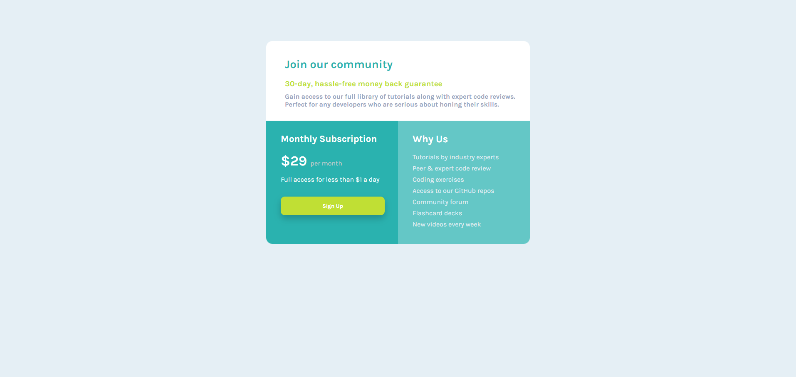

# Frontend Mentor - Solução de componente de grelha de preço único

## Visão geral

### O desafio

Os utilizadores devem ser capazes de:

- Ver o layout ideal para o componente, dependendo do tamanho do ecrã do seu dispositivo
- Ver um estado de foco no ambiente de trabalho para a chamada para ação Inscrever-se

### Captura de ecrã

### Deploy & Repositório

- GitHub: [Repositório GitHub](https://github.com/bruninhosrs/single-price-grid-componente-master)
- Vercel (Deploy): [Vercel](https://single-price-grid-componente-master.vercel.app/)

## Meu processo

### Construído com

- Marcação HTML5
- Propriedades personalizadas CSS
- Flexbox
- Fluxo de trabalho que prioriza os dispositivos móveis (responsividade)

### O que aprendi

### Desenvolvimento contínuo

Não achei que essa foi a melhor estrutura que utilizei, mas deu certo no final. Apenas a responsividade eu não consegui fazer e gostaria de uma ajuda nesta parte.
Acredito que tenho que aprender mais como estruturalizar o `HTML` para que a estilização fique mais fácil e mais fluída.

## Autor

- GitHub - [Bruno Rodrigues](https://github.com/bruninhosrs)
- Mentor de Frontend - [@bruninhosrs](https://www.frontendmentor.io/profile/bruninhosrs)
- LinkedIn - [Bruno Rodrigues](www.linkedin.com/in/rodrigues-silva-bruno)

